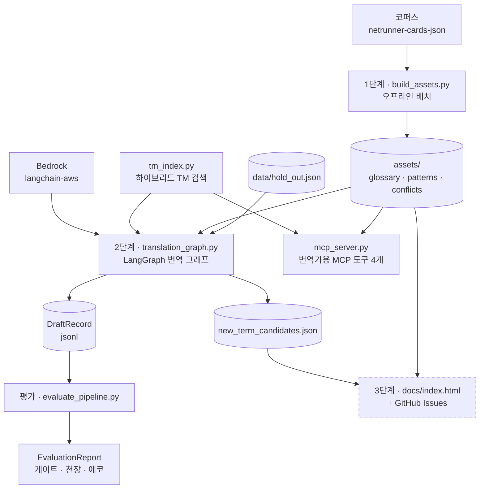
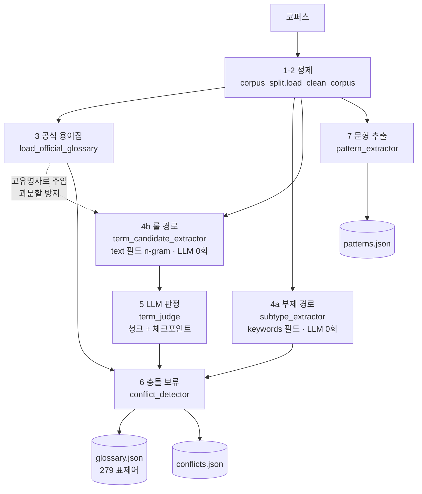
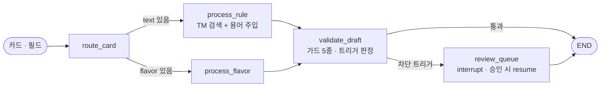
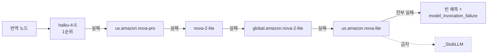
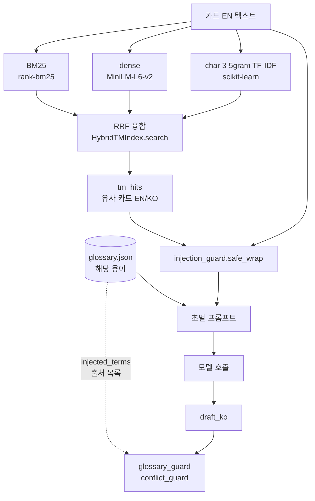
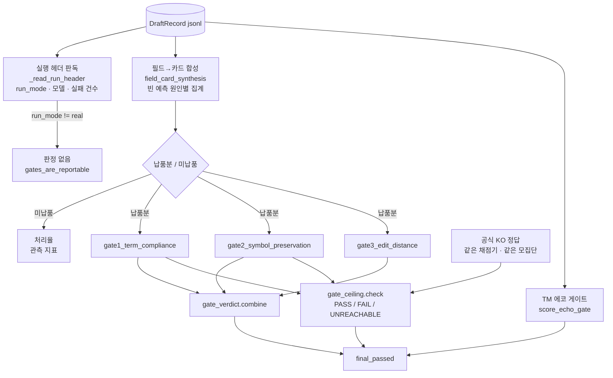

# STACK — 파이프라인 배선과 기술 세트

**갱신 2026-09-18.** 이 문서는 **지금 코드에 실제로 무엇이 어떻게 배선돼 있는지**만 적는다.

- 사양·게이트 정의·임계의 단일 진실 원천은 [`SERVICE.md`](SERVICE.md)다. 여기서 임계나 판정 기준을 다시 쓰지 않는다.
- 진행 상황·다음 할 일·함정은 [`.ouroboros/HANDOFF.md`](.ouroboros/HANDOFF.md)다.
- 번역가(최종 사용자) 관점 진입점은 [`README.md`](README.md)다.

배선도는 mermaid로 그렸다. GitHub 웹에서는 그대로 렌더링되고, 로컬 뷰어가 mermaid를 모르면 코드 블록으로 보인다.

---

## 1. 전체 배선도

점선 = 수동 일회성이고 자동화가 미구현인 경로(§8).

## 2. 기술 세트

| 기술 | 버전 제약 | 어디에 배선돼 있는가 | 역할 |
|---|---|---|---|
| **LangGraph** | `>=1.2.11` | [`src/translation_graph.py:721-776`](src/translation_graph.py#L721-L776) | `StateGraph(CardState)` · 조건부 엣지 라우팅 · `interrupt()`/`Command(resume)` HITL |
| **LangChain** | `langchain-core>=0.3` | 모델 바인딩·메시지 | 체인 프리미티브 |
| **langchain-aws** | `>=0.2` | [`src/run_pipeline.py`](src/run_pipeline.py) `_FallbackLLM` | Bedrock 호출과 모델 폴백 체인 |
| **fastmcp** | `>=2.0` | [`src/mcp_server.py:225-228`](src/mcp_server.py#L225-L228) | 번역가용 MCP 도구 4개 |
| **sentence-transformers** | `>=3.0` | [`src/tm_index.py`](src/tm_index.py) | dense 임베딩 (MiniLM-L6-v2) |
| **rank-bm25** | `>=0.2.2` | 같은 파일 | 어휘 검색 |
| **scikit-learn** | `>=1.4` | 같은 파일 | char 3-5gram TF-IDF |
| **kiwipiepy** | `>=0.18` | [`src/ko_morphology.py`](src/ko_morphology.py) | 한국어 형태소 정규화 |
| **pydantic** | `>=2.6` | 레코드 스키마 | 구조 검증 |
| **pytest** | `>=8.0` | `tests/` 35파일 | 953개 수집 (2026-09-18 실측) |

## 3. 1단계 — 자산 구축 배선

[`src/build_assets.py:108`](src/build_assets.py#L108) `build_assets()` 한 함수가 8단계를 순서대로 엮는다. 각 단계는 별도 모듈이고 이 함수는 **호출만** 한다.

| 단계 | 모듈 | 비고 |
|---|---|---|
| 1-2 정제 | `corpus_split.load_clean_corpus` | 미번역·한글 없는 레코드를 여기서 떨군다 |
| 3 공식 용어집 | `load_official_glossary` | 권위 자산. 추출 대상에서 제외 |
| 4a 부제 경로 | `subtype_extractor` | `keywords` 필드가 EN↔KO 1:1 정렬. LLM 0회 |
| 4b 룰 경로 | `term_candidate_extractor` | `text` 필드 n-gram + Dice/PMI. 공식 KO 용어를 형태소 분석기에 고유명사로 넘겨 과분할을 막는다 (`코드 게이트` → `코드`/`게이트` 방지) |
| 5 LLM 판정 | `term_judge` | 모델이 없으면 미판정으로 쓰고 `llm_judged: false`. 청크 단위 + 체크포인트 + 재시도 실패분을 `rejected`에 접지 않고 따로 보고 |
| 6 충돌 보류 | `conflict_detector` | 사람이 풀기 전까지 용어집에 넣지 않는다 |
| 7 문형 | `pattern_extractor` | |
| 8 기록 | — | 세 JSON을 쓴다 |

산출물 현황: `glossary.json` 평탄화 **279 표제어**, `llm_judged: true`.

## 4. 2단계 — 번역 그래프 배선

**에이전트를 쪼개지 않는다.** 라우팅은 Supervisor나 Plan-Execute가 아니라 조건부 엣지다(SERVICE.md §7의 기각 근거).

**라우팅 단위는 카드가 아니라 `(카드 id, 필드)` 쌍이다.** `text`가 있으면 rule 경로, `flavor`가 있으면 flavor 경로 — 두 필드를 다 가진 카드는 `route`가 다른 `DraftRecord` 2개를 낳는다. 그래서 평가 쪽에 필드→카드 합성 단계가 따로 필요하다(§6).

노드 팩토리는 의존성을 클로저로 주입한다(`_make_process_node` · `_make_validate_node` · `_make_review_queue_node`). 의존성이 없으면 스텁 노드로 조립되지만, 실행 진입점은 스텁을 막는다(§7).

### 가드 투영 (guard_input_projection)

[`src/translation_graph.py:61-85`](src/translation_graph.py#L61-L85)의 `_apply_guard_projections()`가 단일 어댑터다. 각 가드가 `DraftRecord`의 **어느 투영을 받는지** 여기서 고정한다.

| 가드 | 투영 |
|---|---|
| `injection_guard` | `(en_source, draft_ko)` |
| `fidelity_guard` | `(en_source, draft_ko)` |
| `glossary_guard` | `(draft_ko, injected_terms)` |
| `new_term_guard` | `(en_source, draft_ko, glossary)` |
| `conflict_guard` | `(draft_ko, injected_terms, conflicts)` |

규약: **가드를 이 어댑터에 투영 선언 없이 호출하면 호출한 것으로 세지 않는다**(`wiring_vs_reimplementation` 제약). 어댑터는 가드를 재구현하지 않고 import해서 부른다.

### HITL

`new_term_guard`는 **분류만** 하고 차단 판정은 `hitl_interrupt`가 한다(차단형/기록형 분리). 기록형 신규 용어는 인터럽트 없이 탐지 시점에 `new_term_candidates.json`으로 나간다.

트리거 ④(`low_tm_confidence`)의 임계는 상수가 아니라 **그 실행의 `tm_confidence` 분포에서 유도한다** — `run_pipeline.derive_tm_confidence_threshold()`를 먼저 부르고 그 값을 그래프에 넘긴다(`measured_in_run`). `None`을 넘기는 것은 임계를 환경변수로 통제하는 테스트에서만 허용된다.

### 모델 배선

`langchain-aws` → Bedrock. **스텁으로는 절대 폴백하지 않는다** — 전부 실패하면 빈 예측으로 남기고 원인을 기록한다. 스텁 산출물은 TM 히트의 복사라 그것을 채점하면 번역기가 아니라 TM 인덱스를 재게 된다.

## 5. RAG 경로

**주입** — `injected_terms`는 `{en, ko, source, llm_judged}` 출처 목록으로 남고, 그것이 그대로 `glossary_guard`·`conflict_guard`의 투영이 된다. 즉 **주입한 것만 준수 검사를 받는다.**

**신뢰 경계** — [`src/translation_graph.py:341-342`](src/translation_graph.py#L341-L342)가 TM 히트로 돌아온 유사 카드의 `en_text`·`ko_text`에도 `safe_wrap`을 적용한다. 번역 대상 카드 텍스트만 감싸는 게 아니다. 근거: **코퍼스 유래라는 사실은 신뢰의 근거가 아니다.** 검색 결과를 신뢰 경계 밖에 두는 배선이다.

**측정된 한계** — 채택 융합 구성의 편집거리 중앙값이 difflib 문자 유사도 기준선과 사실상 동률이다. bge-m3 교체는 실측 후 기각됐다(출하 구성에서 악화, 인코딩 14배 느림). 병목은 임베딩 모델이 아니라 융합 설계다. 리랭킹 미구현. 수치는 SERVICE.md §5 게이트 3 절, 미결 항목은 HANDOFF §7-3.

## 6. 평가 경로

[`src/evaluate_pipeline.py`](src/evaluate_pipeline.py)가 별도 진입점이다. 게이트 모듈을 재구현하지 않고 채점 결과를 합성한다.

| 단계 | 배선 |
|---|---|
| 입력 | `DraftRecord` jsonl + 실행 헤더(`run_mode`·모델·실패 건수) |
| 필드→카드 | `field_card_synthesis` — `(카드, 필드)` 레코드를 카드 단위로 합치고 빈 예측의 원인별 건수를 낸다 |
| HITL 자동 응답 | `eval_autoresume` — 평가 모드에서 인터럽트에 결정적으로 응답 |
| 게이트 채점 | `gate1_term_compliance` · `gate2_symbol_preservation` · `gate3_edit_distance` → `gate_verdict.combine` |
| 천장 검사 | [`src/gate_ceiling.py`](src/gate_ceiling.py) — 공식 KO 정답을 **같은 채점기·같은 모집단**으로 통과시켜 판정. 게이트 1·2에만 붙는다(정답을 정답과 비교하면 편집거리가 구조상 0이라 게이트 3의 천장 검사는 장식이 된다) |
| TM 에코 게이트 | `score_echo_gate` — `draft_ko`가 자기 `tm_hits[0].ko_text`의 복사인지 본다 |
| 최종 판정 | `final_passed` — 스텁 실행에는 판정을 내지 않고, `UNREACHABLE`은 납품을 막지 않고, 천장 검사 경로에서 게이트 3을 따로 확인한다 |

**모집단 규약** — 하드 게이트는 납품된 예측에만 적용하고 미납품은 처리율 관측 지표로 분리한다(`cards=` 파라미터로 납품 부분집합을 넘긴다). 미납품 카드를 채점하면 "번역이 없다"가 "전 용어 위반"으로 계상돼 번역 품질이 아니라 처리량을 재게 된다.

**관측 지표** — `obs_llm_judge`(룰 문형 일치·플레이버 자연스러움) · `rule_gold_eval`(룰 용어 추출 정밀도·재현율) · `term_extraction_eval` · `tm_baseline`(회귀 감시선).

## 7. 배선 규약 (밟아 본 함정)

- **MCP 도구는 데코레이터로 등록하지 않는다.** `@mcp.tool()`이 모듈 레벨 이름을 `FunctionTool` 객체로 재바인딩해 직접 호출을 깨뜨렸고 테스트 23개가 죽었다. `def`로 정의한 뒤 `mcp.tool()(fn)`으로 등록한다.
- **스텁은 조용히 성공한다.** 진입구 셋을 다 막았다 — `run_pipeline(llm_model)`에 기본값 없음, CLI는 `--allow-stub` 없이 진입 불가, 둘을 함께 주면 거부. 평가 쪽도 `run_mode != real`이면 게이트 판정을 내지 않는다.
- **임계는 상수가 아니라 관계로 쓴다.** TM 신뢰도 임계와 게이트 3 임계 모두 실행 중 측정값에서 유도한다(`measured_in_run`). 상수로 박으면 사양과 구현이 갈라진다.
- **가드는 투영을 선언하고 부른다** (§4).

## 8. 아직 배선되지 않은 것

| 항목 | 상태 |
|---|---|
| **형태소 매칭이 게이트 채점 경로에 없다** | SERVICE.md §5는 게이트 1 채점을 `ko_morphology.normalize_eojeol` 기반으로 교체하라고 적었지만, [`gate1_term_compliance.py`](src/gate1_term_compliance.py)는 여전히 리터럴 부분문자열 매칭이다. 들어간 것은 괄호·공백 정규화와 `scoring_view()`(한글 없는 역어 15개 제외, 279→264)뿐. `ko_morphology`는 `rule_gold_eval`·`term_candidate_extractor`에서만 쓰인다 |
| `gate_verdict.combine`의 사양 드리프트 | 사양은 게이트 1을 관찰 지표로 강등했는데 [`gate_verdict.py:39`](src/gate_verdict.py#L39)는 아직 하드 게이트로 취급해 `failed_gates`에 1을 넣는다. 납품 판정은 `final_passed`가 천장 경로로 우회하므로 막히지 않지만 `format_verdict()` 출력이 사양과 다른 말을 한다 |
| 초벌 프롬프트의 기호 1:1 제약 | [`translation_graph.py:309`](src/translation_graph.py#L309)가 아직 `"Preserve all game symbols exactly"`다. 추가·중복 금지(개수까지 1:1)로 좁히는 처방은 사양에만 있다 |
| `obs_llm_judge`의 배치 규율 | 청크·체크포인트·프롬프트 지문·`dropped` 집계가 없다. `src/term_judge.py`가 그 규율의 기존 구현이다 |
| 3단계 자동화 | 검수 뷰와 Issue 12건은 수동 일회성. 멱등 동기화 배치와 close 반영 경로 미구현. `conflicts.json` rule 경로 13건은 `source_card_ids`가 비어 보류 |
| 검토 큐 REST API | 미구현. 번역가가 지금 쓸 수 있는 것은 MCP 도구 4개뿐이다 |
